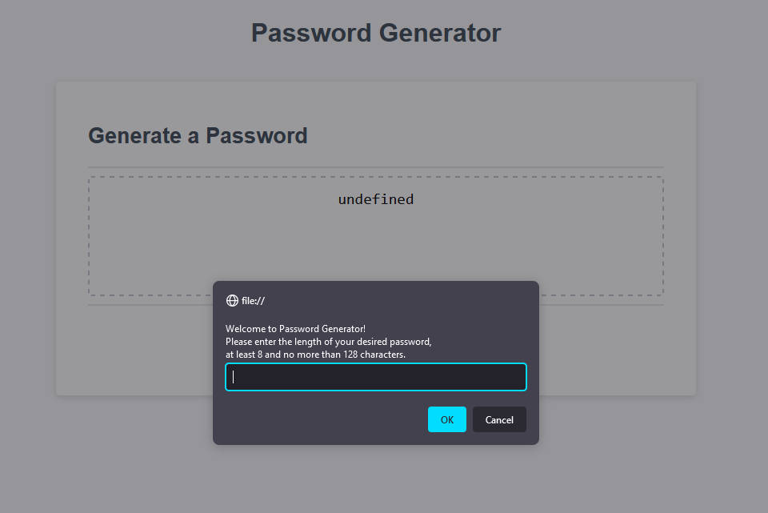
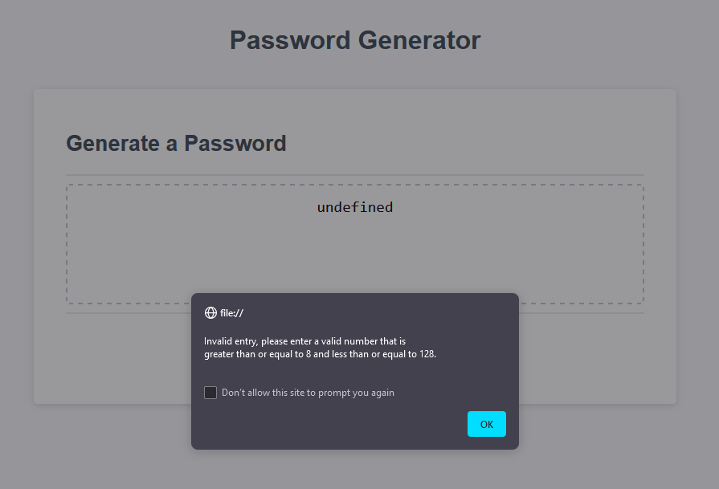
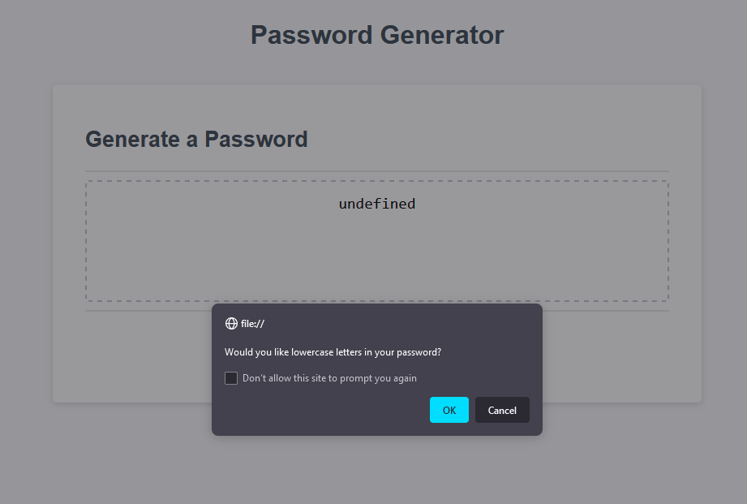
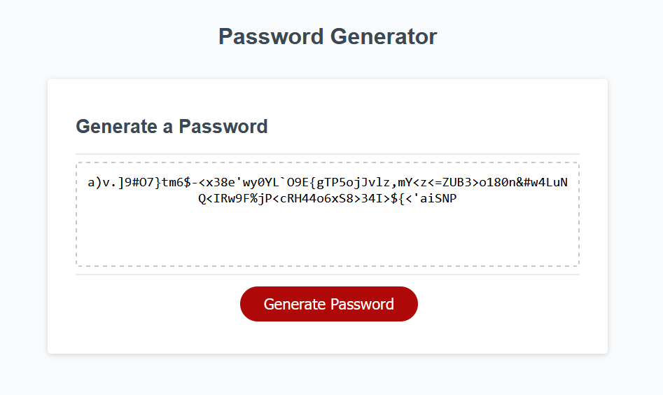

# password-generator

## Description

This project is a password generation program that takes user input of a number of characters and a choice of certain character types. This utilizes javascript prompts and alerts to take user choices and generate a password according to chosen specifications, and shows the generated password in a box.

## Procedure and Challenges

I began with producing pseudocode, which is shown in the next section. The pseudocode breaks down the main sections I would want in the function to produce a password. I then coded based on the pseudocode I had written. Most of the code follows the pseudocode, but some deeper aspects were produced on my own. For instance, generating a random character mandated a function that takes the desired character set and number of characters to generate and returns the string of random characters from that character set, which could then be called every time a random character was needed.

My methodology for producing a string of random characters is as follows:
* Generate 1-4 random characters, which represent the initial user choices of character types. This ensures that every character type is present, just in case random generation happens to randomly not generate a certain type of character.
* Then, generate the remaining characters up to the desired password length, using the generateRandomChar function. This only generates one character at a time, taking from a random character set and making sure that each character set is equally as likely to be chosen.
* The first 1-4 characters of the password are fixed, and we want a secure, more random password. Thus, those 1-4 characters are shuffled into random indexes of the password.

There are many methods of generating characters that could possibly work for this project, but I chose to keep with this functional method. The initial 1-4 character generation may be inefficient, but definitiely ensures the users' choices are satisfied.

## Pseudocode

This program will produce a password after a user presses the generate password button. After pressing the button, user will be prompted to give certain criteria for the password before it is generated and shows up in the text box.

### Initialize
    
    Make generatePassword function
    declare starting variables: 
        lowAlphabet - global
        uppAlphabet - global 
        specChars - global
        numSet - global
        password (string) - local
        passwordLength - local
        useUppercase (bool) - local
        useLowercase (bool) - local
        useSpecial (bool) - local
        useNumbers (bool) - local
        lowerChars (arr) - local
        upperChars (arr) - local
        specialChars (arr) - local
        choices (arr) - local

### Password Length

    Add a prompt that will ask for number of characters, between 8 and 128
    If between 8 and 128, save that number to passwordLength
        else, abort
    
### Character Choices

    Prompt the user for whether they want lowercase/uppercase/special/number characters
    Add bool to choices array
    Repeat 4x for each character type

### Generating the Password
    
    Generate the first 1-4 characters depending on the user choices
    For the remaining length of the password between the current password and the desired password length,
        generate a new character based on current choices, making sure it is a random character type
        add it to the end of password
    Randomize the current password string
    Return the password for the function

## Testing

The password generator was tested for certain user inputs and shows no bugs.
* Non-number user inputs for the number of characters throws and error, so that only numbers may be used for passwordLength. Any number, special character, or cancel button will be an invalid input. Additionally, numbers above 128 and below 8 are also restricted.
* All combinations of character type inputs have been tested to work. If a user chooses no character types, they are alerted to make sure they choose an input, and then prompted to try again.

## Screenshots

* Clicking Generate Password 

* Invalid Entry of Password Length

* Prompts asking about Desired Character Types

* Final Result

## Credits

Credit to https://bobbyhadz.com/blog/javascript-insert-string-at-index for  code for inserting a string.

Credit to https://owasp.org/www-community/password-special-characters for the list of special characters and the string that contains them.

## Github Deployed Site Link and Repository Link

Github Repository: https://github.com/voravichs/password-generator

Github Pages Deployment: https://voravichs.github.io/password-generator/

